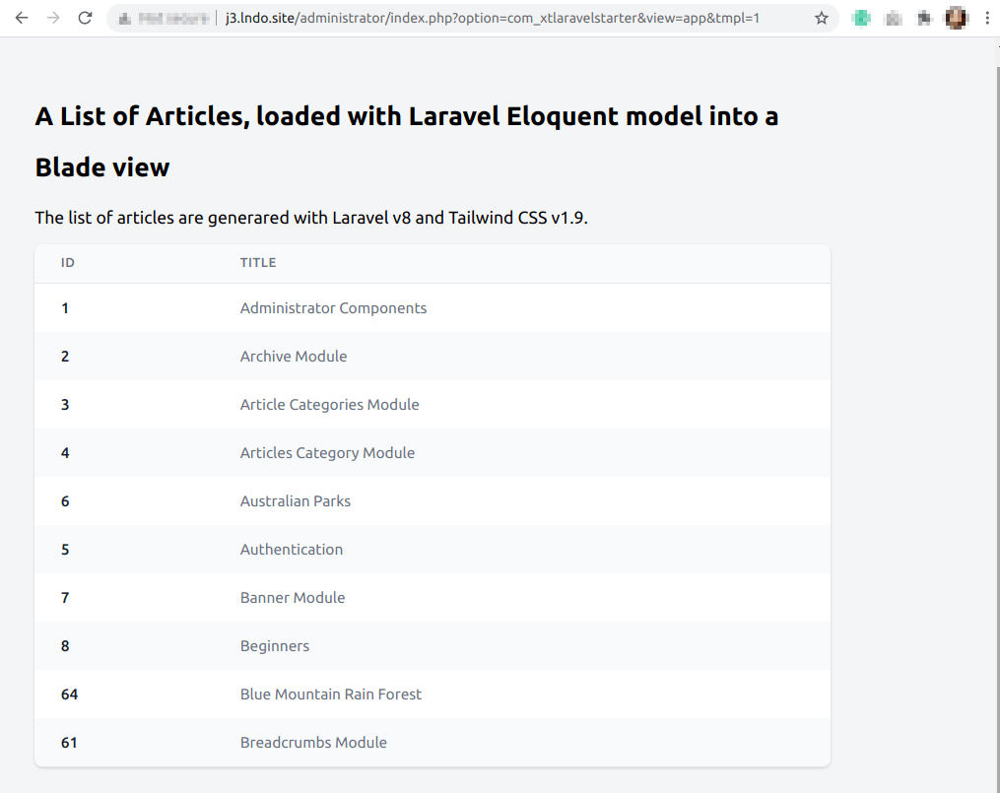

# ¿Qué es Composer? <!-- .slide: class="list-small" -->

<!-- .element: class="w-12" -->

[getcomposer.org](https://getcomposer.org)


<!-- .element: class="w-12" -->

- Una Administrador de Dependencias (Librerías)
- Un Administrador de Paquetes a nivel de aplicación
- Está fuertemente inspirado por Node.js's "npm" y Ruby's "bundler"


## Packagist <!-- .slide: class="p-small" data-background-image="images/10-what-is-composer/logo-packagist-small.png" data-background-size="auto auto" data-background-position="90% 10%" data-visibility="hidden" -->

<!-- .element: class="w-50" -->


## Packagist - Estadísticas <!-- .slide: data-background-image="images/10-what-is-composer/logo-packagist-small.png" data-background-size="auto auto" data-background-position="90% 10%" data-visibility="hidden" -->

<!-- .element: class="w-50" -->

- 323 K Packages
- 1600 M Installs/mo (Septiembre 2021)


## Paquetes Destacados <!-- .slide: class="table-small" data-visibility="hidden" -->

Package Name | Downloads
------------ | -------------
symfony/console | 259 558 850
guzzlehttp/guzzle | 227 583 337
monolog/monolog | 251 635 763
phpunit/phpunit | 219 664 109
nesbot/carbon | 147 951 475
league/flysystem | 133 508 404
laravel/framework | 114 282 476


## La Motivación

<div class="fragment fade-up">
    <figure>
        <blockquote>
            <p>Si he logrado ver más lejos ha sido porque he subido a hombros de gigantes</p>
        </blockquote>
        <figcaption>—Isaac Newton</figcaption>
    </figure>
</div>


## Más Razones <!-- .slide: class="list-small list-none" -->

- Compartir Código Abierto y Buenas Prácticas ✔
- Adoptar las innovaciones PHP más recientes ✔
- Usar frameworks populares y probados ✔
- Separación de Intereses (SoC) ✔
- Centrarse en el desarrollo de negocio ✔
- Mejor definición del Dominio ✔
- Desarrolle independiente del CMS ✔


## Composer como una "Herramienta" de Comunicación <!-- .slide: class="list-small" -->

- Acceso al Hub de Packagist
- Acceso Directo a Repositorios Públicos/ Privados
- Uso de Autoloaders Estándars


## FIG PSR-4 Estándar<!-- .slide: class="table-tiny" -->

Fully Qualified Class Name|Namespace|Directory|File Path
---------|----------|---------|---------
\Acme\Log\Writer\File_Writer | Acme\Log\Writer | ./acme-log-writer/lib/ | ./acme-log-writer/lib/File_Writer.php
\Aura\Web\Response\Status | Aura\Web | /path/to/aura-web/src/ | /path/to/aura-web/src/Response/Status.php
\Symfony\Core\Request | Symfony\Core | ./vendor/Symfony/Core/ | ./vendor/Symfony/Core/Request.php
\Zend\Acl | Zend | /usr/includes/Zend/ | /usr/includes/Zend/Acl.php


## Ejemplo PSR-4<!-- .slide: class="table-small" -->

```json
...
{
  "autoload": {
    "psr-4": {
      "XTSearchforAlgolia\\": "library/src/"
    }
  },
  "autoload-dev": {
    "psr-4": {
      "Tests\\": "library/tests/"
    }
  },
}
...
```


## Mapa de Clases y Carga Automática

```json
...
    "autoload": {
        "classmap": [
            "lib_extly"
        ],
        "files": [
            "src/helpers.php"
        ]
    },
...
```

Autoloader rápido para migrar liberías legacy.<!-- .element: class="small" -->


## Generación Rápida de Autoloaders Optimizados

<!-- .element: class="w-25" -->

```sh
# TIP
$ composer dump-autoload --classmap-authoritative
```


## Todo dentro del Plugin

<!-- .element: class="w-80" -->

El plugin contiene todos las librerías definidas en ´composer.json´.<!-- .element: class="small" -->


## Un plugin de WordPress plugin puede usar Composer

```json
{
    "name": "php-prefixer/using-guzzle-in-a-word-press-plug-in-with-php-prefixer",
    "description": "Using Guzzle in a WordPress plug-in with PHP-Prefixer. A plugin to showcase the PHP-Prefixer service. Install any library freely. PHP-Prefixer will manage your namespaces.",
    "require": {
        "guzzlehttp/guzzle": "^7.3"
    },
    "extra": {
        "php-prefixer": {
            "project-name": "Using Guzzle in a WordPress plug-in with PHP-Prefixer",
            "namespaces-prefix": "PPP",
            "global-scope-prefix": "PPP_",
            "exclude-paths": [
                "bin/"
            ]
        }
    }
}
```


## The Laravel Starter <!-- .slide: class="list-small" data-background-repeat="no-repeat" data-background-image="images/10-what-is-composer/WordPress-isologo-web.svg" data-background-size="8% auto" data-background-position="90% 10%" class="list-small" -->

<!-- .element: class="w-50" -->

- [anibalsanchez/xt-laravel-starter-for-joomla](https://github.com/anibalsanchez/xt-laravel-starter-for-joomla) - The "Entry Points"
- [anibalsanchez/xt-laravel-starter-for-joomla-library](https://github.com/anibalsanchez/xt-laravel-starter-for-joomla-library) - "The Library"


## The View<!-- .slide: class="list-small" data-background-repeat="no-repeat" data-background-image="images/10-what-is-composer/logomark.min.svg" data-background-size="8% auto" data-background-position="90% 10%" class="list-small" -->

```php
Route::get('/', function () {
    $articles = Article::where('state', 1)
        ->orderBy('title', 'asc')
        ->take(10)
        ->get();

    return view('welcome', ['articles' => $articles]);
});
```

Using the Eloquent model and a Blade view.


## Where is the catch <!-- .slide: data-background-image="images/10-what-is-composer/composer-two-developers.jpg" data-background-size="75% auto" data-background-position="50% 50%" class="slide-hero" -->

Photos by Kelly Sikkema and LagosTechie on Unsplash.<!-- .element: class="tiny" -->


## Where is the catch - Example

```json [14-18]
{
    "name": "extly/xtlaravelstarter",
    "type": "project",
    "description": "This project is a good starting point to begin using the Laravel Framework on Joomla.",
    "keywords": [
        "joomla",
        "framework",
        "laravel"
    ],
    "license": "MIT",
    "require": {
        "php": "^7.3 || ^8.0",
        "fideloper/proxy": "^4.4",
        "fruitcake/laravel-cors": "^2.0",
        "guzzlehttp/guzzle": "^7.0.1",
        "laravel/framework": "^8.12",
        "laravel/tinker": "^2.5",
        "laravel/ui": "^3.1"
    },
...
```


## Two teams

- Developer A ➡ `guzzlehttp/guzzle:^7.0`
- Developer B ➡ `guzzlehttp/guzzle:^5.3`

Two independent developers can choose different library version, or libraries with the same namespaces, and the site admin can install them on the site same.<!-- .element: class="small" -->


## A conflict

```php [3-5|10-12]
// Guzzle 7 - Send an asynchronous request.
$request = new \GuzzleHttp\Psr7\Request('GET', 'http://httpbin.org');
$promise = $client->sendAsync($request)->then(function ($response) {
    echo 'I completed! ' . $response->getBody();
});
$promise->wait();

// Guzzle 5.3 - Send an asynchronous request.
$req = $client->createRequest('GET', 'http://httpbin.org', ['future' => true]);
$client->send($req)->then(function ($response) {
    echo 'I completed! ' . $response;
});
```
