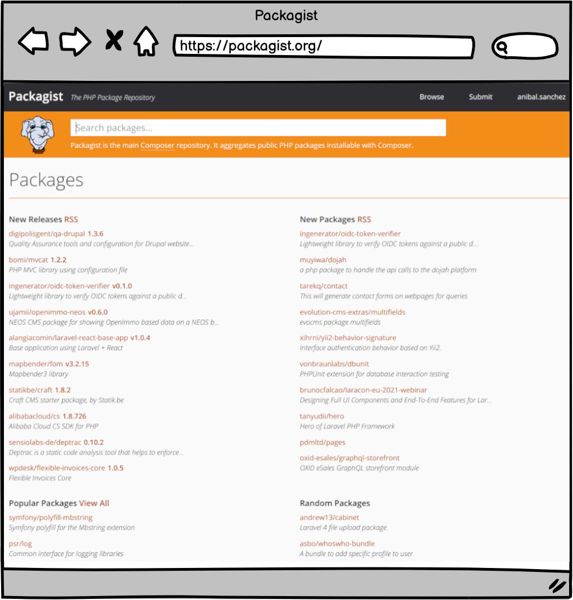
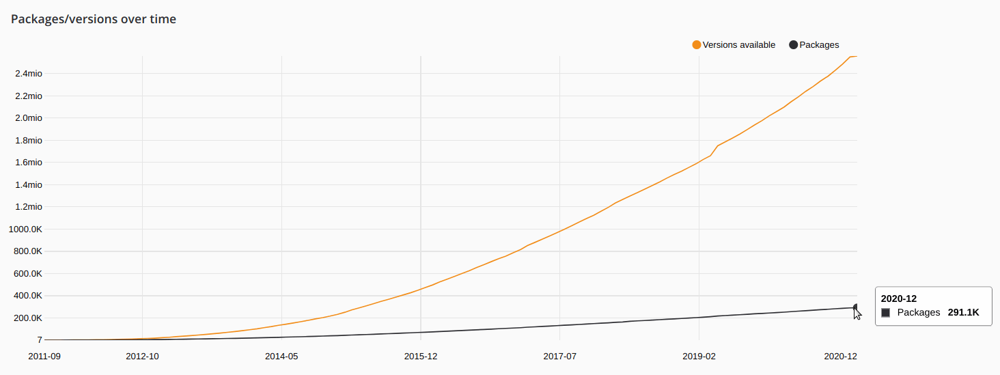
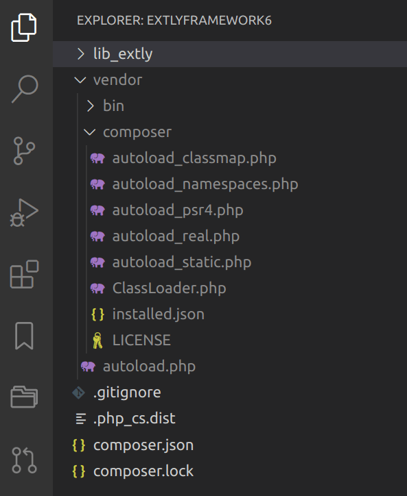
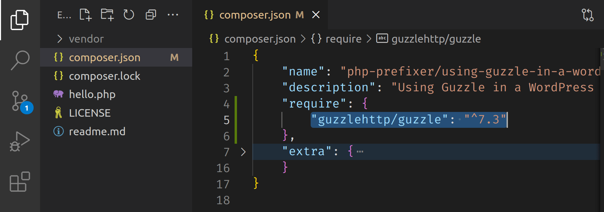

# ¿Qué es Composer? <!-- .slide: class="list-small" -->

<!-- .element: class="w-12" -->

[getcomposer.org](https://getcomposer.org)


<!-- .element: class="w-12" -->

- Un Administrador de Dependencias (Librerías)
- Un Administrador de Paquetes a nivel de aplicación
- Está fuertemente inspirado por Node.js's "npm" y Ruby's "bundler"


## Packagist <!-- .slide: class="p-small" data-background-image="images/10-what-is-composer/logo-packagist-small.png" data-background-size="auto auto" data-background-position="90% 10%" -->

<!-- .element: class="w-50" -->


## Packagist - Estadísticas <!-- .slide: data-background-image="images/10-what-is-composer/logo-packagist-small.png" data-background-size="auto auto" data-background-position="90% 10%" -->

<!-- .element: class="w-50" -->

- 323 K Packages
- 1600 M Installs/mo (Septiembre 2021)


## Paquetes Destacados <!-- .slide: class="table-small" -->

Package Name | Downloads
------------ | -------------
symfony/console | 259 558 850
guzzlehttp/guzzle | 227 583 337
monolog/monolog | 251 635 763
phpunit/phpunit | 219 664 109
nesbot/carbon | 147 951 475
league/flysystem | 133 508 404
laravel/framework | 114 282 476


## La Motivación

<div class="fragment fade-up">
    <figure>
        <blockquote>
            <p>Si he logrado ver más lejos ha sido porque he subido a hombros de gigantes</p>
        </blockquote>
        <figcaption>—Isaac Newton</figcaption>
    </figure>
</div>


## Más Razones <!-- .slide: class="list-small list-none" -->

- Compartir Código Abierto y Buenas Prácticas ✔
- Adoptar las innovaciones PHP más recientes ✔
- Usar frameworks populares y probados ✔
- Separación de Intereses (SoC) ✔
- Centrarse en el desarrollo de negocio ✔
- Mejor definición del Dominio ✔
- Desarrollar independiente del CMS ✔


## Composer como una <br>"Herramienta" de Comunicación <!-- .slide: class="list-small" -->

- Acceso al hub de Packagist
- Acceso directo a Repositorios Públicos/ Privados
- Uso de Autoloaders Estándars


## FIG PSR-4 Estándar<!-- .slide: class="table-tiny" -->

Fully Qualified Class Name|Namespace|Directory|File Path
---------|----------|---------|---------
\Acme\Log\Writer\File_Writer | Acme\Log\Writer | ./acme-log-writer/lib/ | ./acme-log-writer/lib/File_Writer.php
\Aura\Web\Response\Status | Aura\Web | /path/to/aura-web/src/ | /path/to/aura-web/src/Response/Status.php
\Symfony\Core\Request | Symfony\Core | ./vendor/Symfony/Core/ | ./vendor/Symfony/Core/Request.php
\Zend\Acl | Zend | /usr/includes/Zend/ | /usr/includes/Zend/Acl.php


## Ejemplo PSR-4<!-- .slide: class="table-small" -->

```json
...
{
  "autoload": {
    "psr-4": {
      "XTSearchforAlgolia\\": "library/src/"
    }
  },
  "autoload-dev": {
    "psr-4": {
      "Tests\\": "library/tests/"
    }
  },
}
...
```


## Mapa de Clases y Carga Automática

```json
...
    "autoload": {
        "classmap": [
            "lib_extly"
        ],
        "files": [
            "src/helpers.php"
        ]
    },
...
```

Autoloader rápido para migrar liberías legacy.<!-- .element: class="small" -->


## Generación Rápida de Autoloaders Optimizados

<!-- .element: class="w-25" -->

```sh
# TIP
$ composer dump-autoload --classmap-authoritative
```


## Un plugin de WordPress usando Composer <!-- .slide: data-background-image="images/05-about-me/PHP-Prefixer.svg" data-background-size="auto 10%" data-background-position="95% 5%" -->

<!-- .element: class="w-80" -->

El plugin "Hello Dolly", pero consultando un API con Datos Interesantes.<!-- .element: class="small" -->
<br>
<https://blog.php-prefixer.com/2021/10/20/using-guzzle-in-a-wordpress-plugin-with-php-prefixer/><!-- .element: class="small" -->


## Un plugin de WordPress usando Composer <!-- .slide: data-background-image="images/05-about-me/PHP-Prefixer.svg" data-background-size="auto 10%" data-background-position="95% 5%" -->

<!-- .element: class="w-80" -->

El plugin contiene todas las librerías definidas en `composer.json`.<!-- .element: class="small" -->
<br>
<https://github.com/PHP-Prefixer/using-guzzle-in-a-word-press-plug-in-with-php-prefixer><!-- .element: class="small" -->


## ¿Cuál es el problema? <!-- .slide: data-background-image="images/10-what-is-composer/composer-two-developers.jpg" data-background-size="75% auto" data-background-position="50% 50%" class="slide-hero" -->

Photos by Kelly Sikkema and LagosTechie on Unsplash.<!-- .element: class="tiny" -->


## Si dos desarrolladores independientes trabajan con Composer ...

- Desarrollador A ➡ `guzzlehttp/guzzle:^5.3`
- Desarrollador B ➡ `guzzlehttp/guzzle:^7.4`

Dos desarrolladores independientes pueden elegir una versión de biblioteca diferente o bibliotecas con los mismos espacios de nombres, y el administrador del sitio puede instalarlas en el mismo sitio.<!-- .element: class="small" -->


## Si desarrollo un sistema 2019 y luego vuelvo a trabajar en 2021 ...

- Año 2019 ➡ `guzzlehttp/guzzle:^5.3`
- Año 2021 ➡ `guzzlehttp/guzzle:^7.4`

El mismo desarrollador "por tiempos" puede tener que desarrollar con diferentes versiones.<!-- .element: class="small" -->


## Un conflicto

```php [3|9]
// Guzzle 5.3 - Send an asynchronous request.
$req = $client->createRequest('GET', 'http://httpbin.org', ['future' => true]);
$client->send($req)->then(function ($response) {
    echo 'I completed! ' . $response;
});

// Guzzle 7 - Send an asynchronous request.
$request = new \GuzzleHttp\Psr7\Request('GET', 'http://httpbin.org');
$promise = $client->sendAsync($request)->then(function ($response) {
    echo 'I completed! ' . $response->getBody();
});
```
