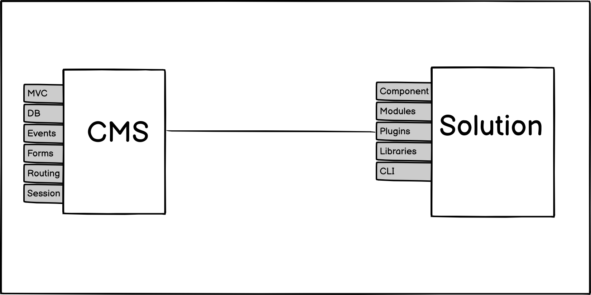
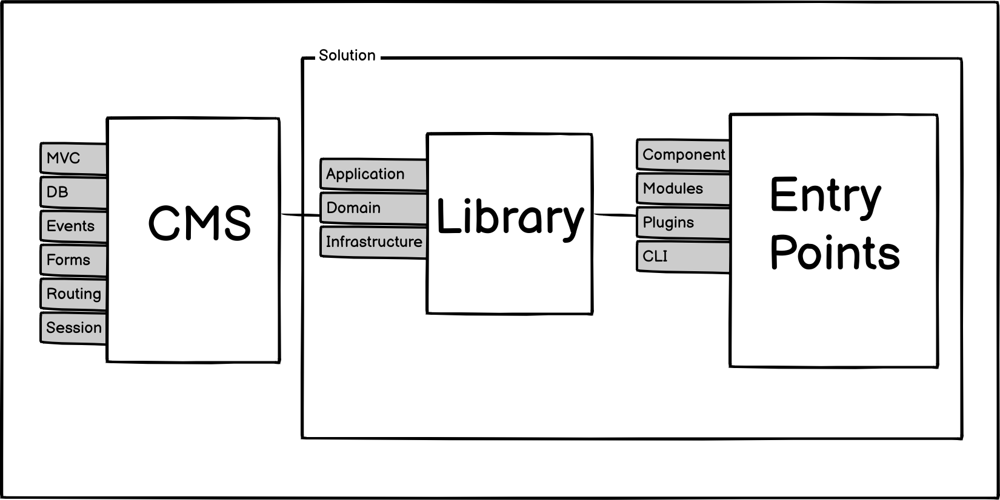
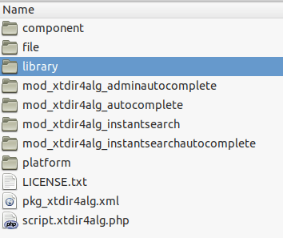

# Prerequisites <!-- .slide: class="list-small" -->

- PHP development
- Joomla management
- Extension development


## What is Composer? <!-- .slide: class="list-small" -->

<!-- .element: class="w-12" -->

- A Dependency Manager for PHP - [getcomposer.org](https://getcomposer.org)
- An application-level package manager
- It's strongly inspired by Node.js's "npm" and Ruby's "bundler"


## Packagist <!-- .slide: class="p-small" data-background-image="images/10-what-is-composer/logo-packagist-small.png" data-background-size="auto auto" data-background-position="90% 10%" data-visibility="hidden" -->

<!-- .element: class="w-50" -->


## Packagist - Statistics <!-- .slide: data-background-image="images/10-what-is-composer/logo-packagist-small.png" data-background-size="auto auto" data-background-position="90% 10%" data-visibility="hidden" -->

<!-- .element: class="w-50" -->

- 290 K Packages
- 1200 M Installs/mo


## Featured Packages <!-- .slide: class="table-small" data-visibility="hidden" -->

Package Name | Downloads
------------ | -------------
symfony/polyfill-mbstring | 281 187 883
symfony/console | 259 558 850
guzzlehttp/guzzle | 227 583 337
monolog/monolog | 251 635 763
phpunit/phpunit | 219 664 109
nesbot/carbon | 147 951 475
league/flysystem | 133 508 404
laravel/framework | 114 282 476


## The motivation

<div class="fragment fade-up">
    <figure>
        <blockquote>
            <p>If I have seen further it is by standing on the shoulders of Giants.</p>
        </blockquote>
        <figcaption>—Isaac Newton</figcaption>
    </figure>
</div>


## More reasons <!-- .slide: class="list-small list-none" -->

- Adopt the most recent PHP innovations ✔
- Use other frameworks / methodologies ✔
- Separation of Concerns ✔
- Better definition of the Domain ✔
- Focus on business development ✔
- Develop with a CMS-agnostic stack ✔


## The motivation <!-- .slide: class="list-small" -->

<!-- .element: class="w-80" -->

Classic extension <!-- .slide: class="small" -->


## The motivation <!-- .slide: class="list-small" -->

<!-- .element: class="w-80" -->

A modern solution centered on a library <!-- .slide: class="small" -->


## Composer in Joomla terms <!-- .slide: data-visibility="hidden" -->

```json [1-4|10-13|29-44]
{
    "name": "joomla/joomla-cms",
    "type": "project",
    "description": "Joomla CMS",
    "keywords": ["joomla", "cms"],
    "homepage": "https://github.com/joomla/joomla-cms",
    "license": "GPL-2.0-or-later",
    "config": {
        "optimize-autoloader": true,
        "platform": {
            "php": "5.3.10"
        },
        "vendor-dir": "libraries/vendor",
        "github-protocols": ["https"]
    },
    "support": {
        "issues": "https://issues.joomla.org",
        "irc": "https://irc.lc/freenode/joomla/",
        "forum": "https://forum.joomla.org/",
        "docs": "https://docs.joomla.org"
    },
    "repositories": [
      {
        "type": "github",
        "url": "https://github.com/joomla-backports/lessphp.git"
      }
    ],
    "require": {
        "php": ">=5.3.10",
        "joomla/application": "~1.9",
        "joomla/archive": "^1.1.7",
        "joomla/data": "~1.2",
        "joomla/di": "~1.5",
        "joomla/event": "~1.2",
        "joomla/filter": "^1.3.2",
        "joomla/image": "^1.5",
        "joomla/input": "~1.3",
        "joomla/ldap": "~1.2",
        "joomla/registry": "^1.6",
        "joomla/session": "^1.3.4",
        "joomla/string": "^1.4",
        "joomla/uri": "~1.2",
        "joomla/utilities": "^1.6",
        "ircmaxell/password-compat": "1.*",
        "leafo/lessphp": "dev-joomla3-php8",
        "paragonie/random_compat": "~1.4",
        "paragonie/sodium_compat": "1.9.1",
        "phpmailer/phpmailer": "^5.2.20",
        "symfony/polyfill-php55": "~1.9",
        "symfony/polyfill-php56": "~1.9",
        "symfony/polyfill-php71": "~1.9",
        "symfony/polyfill-php73": "~1.9",
        "symfony/yaml": "2.*",
        "simplepie/simplepie": "1.3.1",
        "google/recaptcha": "^1.1",
        "typo3/phar-stream-wrapper": "^2.1"
    },
    "require-dev": {
        "phpunit/phpunit": "^4.8.35",
        "phpunit/dbunit": "~1.3",
        "friendsofphp/php-cs-fixer": "~1.11",
        "squizlabs/php_codesniffer": "~1.5",
        "pear/cache_lite": "1.7.16"
    },
    "minimum-stability": "dev",
    "prefer-stable": true
}
```


## The extensions can use Composer


## Composer as an "utility" <!-- .slide: class="list-small" -->

- Forget `JLoader` & `jimport`
- Embrace `require .../vendor/autoload.php;`
- Use Composer Autoloaders


## FIG PSR-4 Standard<!-- .slide: class="table-tiny" -->

Fully Qualified Class Name|Namespace|Directory|File Path
---------|----------|---------|---------
\Acme\Log\Writer\File_Writer | Acme\Log\Writer | ./acme-log-writer/lib/ | ./acme-log-writer/lib/File_Writer.php
\Aura\Web\Response\Status | Aura\Web | /path/to/aura-web/src/ | /path/to/aura-web/src/Response/Status.php
\Symfony\Core\Request | Symfony\Core | ./vendor/Symfony/Core/ | ./vendor/Symfony/Core/Request.php
\Zend\Acl | Zend | /usr/includes/Zend/ | /usr/includes/Zend/Acl.php


## PSR-4 Example<!-- .slide: class="table-small" -->

```json
...
{
  "autoload": {
    "psr-4": {
      "XTSearchforAlgolia\\": "library/src/"
    }
  },
  "autoload-dev": {
    "psr-4": {
      "Tests\\": "library/tests/"
    }
  },
}
...
```


## Classmap & Autoloading

```json
...
    "autoload": {
        "classmap": [
            "lib_extly"
        ],
        "files": [
            "src/helpers.php"
        ]
    },
...
```

Handy autoloader generation to migrate legacy extensions.<!-- .element: class="small" -->


## Generated maps

<!-- .element: class="w-33" -->

```sh
# TIP
$ composer dump-autoload --classmap-authoritative
```


## The extensions can use Composer <!-- .slide: data-visibility="hidden" -->

```json [1-3|14-18]
{
    "name": "anibalsanchez/perfect-publisher-legacy",
    "description": "Perfect Publisher Legacy Helpers Library.",
    "authors": [
        {
            "name": "Extly CB",
            "email": "team@extly.com"
        }
    ],
    "license": "GPL-3.0-or-later",
    "require": {
        "php": ">=5.6"
    },
    "autoload": {
        "classmap": [
            "src"
        ]
    },
    "config": {
        "preferred-install": "dist",
        "sort-packages": true,
        "optimize-autoloader": true
    },
    "minimum-stability": "dev",
    "prefer-stable": true
}
```


## Everything in the library

<!-- .element: class="w-50" -->

Packages and Libraries are the best structure to incorporate Composer.<!-- .element: class="small" -->


## The Laravel Starter <!-- .slide: class="list-small" data-background-repeat="no-repeat" data-background-image="images/10-what-is-composer/logomark.min.svg" data-background-size="8% auto" data-background-position="90% 10%" class="list-small" -->

<!-- .element: class="w-50" -->

- [anibalsanchez/xt-laravel-starter-for-joomla](https://github.com/anibalsanchez/xt-laravel-starter-for-joomla) - The "Entry Points"
- [anibalsanchez/xt-laravel-starter-for-joomla-library](https://github.com/anibalsanchez/xt-laravel-starter-for-joomla-library) - "The Library"


## The View<!-- .slide: class="list-small" data-background-repeat="no-repeat" data-background-image="images/10-what-is-composer/logomark.min.svg" data-background-size="8% auto" data-background-position="90% 10%" class="list-small" -->

```php
Route::get('/', function () {
    $articles = Article::where('state', 1)
        ->orderBy('title', 'asc')
        ->take(10)
        ->get();

    return view('welcome', ['articles' => $articles]);
});
```

Using the Eloquent model and a Blade view.


## Where is the catch <!-- .slide: data-background-image="images/10-what-is-composer/composer-two-developers.jpg" data-background-size="75% auto" data-background-position="50% 50%" class="slide-hero" -->

Photos by Kelly Sikkema and LagosTechie on Unsplash.<!-- .element: class="tiny" -->


## Where is the catch - Example

```json [14-18]
{
    "name": "extly/xtlaravelstarter",
    "type": "project",
    "description": "This project is a good starting point to begin using the Laravel Framework on Joomla.",
    "keywords": [
        "joomla",
        "framework",
        "laravel"
    ],
    "license": "MIT",
    "require": {
        "php": "^7.3 || ^8.0",
        "fideloper/proxy": "^4.4",
        "fruitcake/laravel-cors": "^2.0",
        "guzzlehttp/guzzle": "^7.0.1",
        "laravel/framework": "^8.12",
        "laravel/tinker": "^2.5",
        "laravel/ui": "^3.1"
    },
...
```


## Two teams

- Developer A ➡ `guzzlehttp/guzzle:^7.0`
- Developer B ➡ `guzzlehttp/guzzle:^5.3`

Two independent developers can choose different library version, or libraries with the same namespaces, and the site admin can install them on the site same.<!-- .element: class="small" -->


## A conflict

```php [3-5|10-12]
// Guzzle 7 - Send an asynchronous request.
$request = new \GuzzleHttp\Psr7\Request('GET', 'http://httpbin.org');
$promise = $client->sendAsync($request)->then(function ($response) {
    echo 'I completed! ' . $response->getBody();
});
$promise->wait();

// Guzzle 5.3 - Send an asynchronous request.
$req = $client->createRequest('GET', 'http://httpbin.org', ['future' => true]);
$client->send($req)->then(function ($response) {
    echo 'I completed! ' . $response;
});
```
