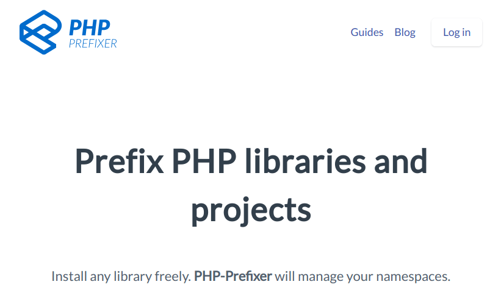
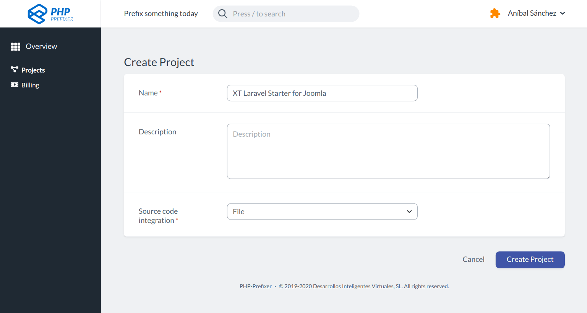
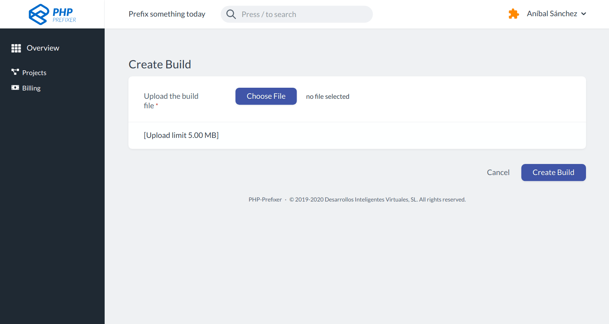
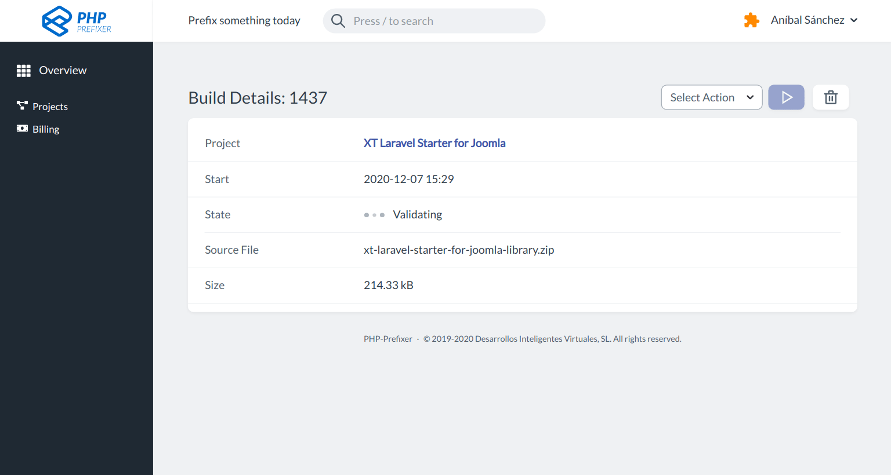
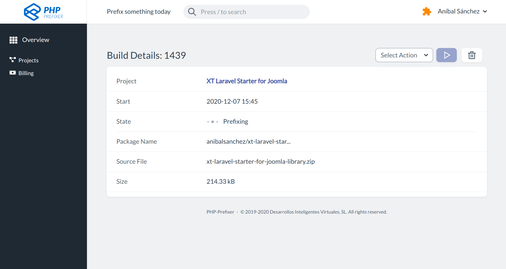
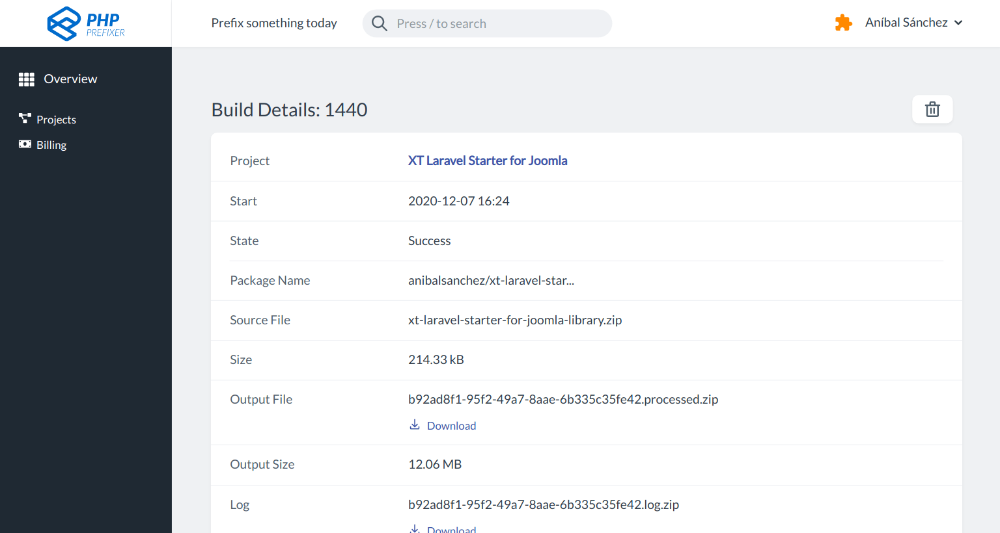

# Prefijos en PHP <!-- .slide: class="p-small" -->

Caso 1: Fragmento de código de `nesbot/carbon`, una extensión para el API del DateTime.

```php [1-5]
namespace Carbon;

use Carbon\Exceptions\InvalidDateException;
use DateInterval;
use Symfony\Component\Translation;

class Carbon extends DateTime
{
    const NO_ZERO_DIFF = 01;
```


## Prefijos en el namespace<!-- .slide: class="p-small" -->

Caso 1: Fragmento de código de `nesbot/carbon` con el prefijo `Extly`.

```php [1-5]
namespace Extly\Carbon;

use Extly\Carbon\Exceptions\InvalidDateException;
use DateInterval;
use Extly\Symfony\Component\Translation;

class Carbon extends DateTime
{
    const NO_ZERO_DIFF = 01;
```


## Prefijos en PHP - Caso 2<!-- .slide: class="p-small" -->

Caso 2: Fragmento de código librería Laravel `illuminate/support`.

```php [3-4|9-10]
use Illuminate\Container\Container;

if (! function_exists('abort')) {
    function abort($code, $message = '')
    {
        return app()->abort($code, $message, $headers);
...

if (! function_exists('app')) {
    function app($make = null)
```


## Prefijos en PHP - Caso 2 <!-- .slide: class="p-small" -->

Caso 2: Fragmento de código de la librería Laravel `illuminate/support` con el prefijo `XT_`.

```php [3-4|9-10]
use Extly\Illuminate\Container\Container;

if (! function_exists('XT_abort')) {
    function XT_abort($code, $message = '')
    {
        return XT_app()->abort($code, $message, $headers);
...

if (! function_exists('XT_app')) {
    function XT_app($make = null)
```


## Un plugin de WordPress usando Composer

```json [8-11]
{
    "name": "php-prefixer/using-guzzle-in-a-word-press-plug-in-with-php-prefixer",
    "description": "Using Guzzle in a WordPress plug-in with PHP-Prefixer. A plugin to showcase the PHP-Prefixer service. Install any library freely. PHP-Prefixer will manage your namespaces.",
    "require": {
        "guzzlehttp/guzzle": "^7.3"
    },
    "extra": {
        "php-prefixer": {
            "project-name": "Using Guzzle in a WordPress plug-in with PHP-Prefixer",
            "namespaces-prefix": "PPP",
            "global-scope-prefix": "PPP_",
            "exclude-paths": [
                "bin/"
            ]
        }
    }
}
```


## Un plugin de WordPress usando Composer

```php [1]
use GuzzleHttp\Client as GuzzleHttpClient;

function hello_prefixed_guzzle_get_number_fact()
{
   // Create a client
   $client = new GuzzleHttpClient();
   $response = $client->get('http://numbersapi.com/'.mt_rand(0, 256));

   return wptexturize($response->getBody());
}
```


## Un plugin de WordPress usando Composer

```php [1]
use PPP\GuzzleHttp\Client as GuzzleHttpClient;

function hello_prefixed_guzzle_get_number_fact()
{
   // Create a client
   $client = new GuzzleHttpClient();
   $response = $client->get('http://numbersapi.com/'.mt_rand(0, 256));

   return wptexturize($response->getBody());
}
```


## Aplicando prefijos a proyectos PHP <!-- .slide: class="list-small" -->

Necesitamos aplicar prefijos automáticamente:

- Librerías completas
- Namespaces y funciones en el ámbito global
- Pruebas unitarias
- Diferentes versiones de librerías y PHP


## Presentamos PHP Prefixer <!-- .slide: class="p-small" -->

<!-- .element: class="w-80" style="border-radius: .25rem; border-width: 1px; border-color: #aaa; border-style: solid;" -->

https://php-prefixer.com - Lanzado en Noviembre 2020


## Presentamos PHP Prefixer <!-- .slide: data-background-repeat="no-repeat" data-background-image="images/05-about-me/PHP-Prefixer.svg" data-background-size="8% auto" data-background-position="90% 10%" class="list-small" -->

PHP-Prefixer se puede usar:

- En el [sitio Web](https://php-prefixer.com), subiendo y bajando un ZIPs
- Por Comando de Linea [CLI](https://php-prefixer.com/docs/command-line/)
- Con [GitHub Actions](https://php-prefixer.com/docs/command-line/)
- Con el [API REST](https://php-prefixer.com/docs/command-line/)


## Prefijos en PHP - Creación del Proyecto

<!-- .element: style="heigth: 80%" -->


## Prefijos en PHP - Subir un Build <!-- .slide: data-visibility="hidden" -->

<!-- .element: style="heigth: 80%" -->


## Prefijos en PHP - Validación <!-- .slide: data-visibility="hidden" -->

<!-- .element: style="heigth: 80%" -->


## Prefijos en PHP - Proceso <!-- .slide: data-visibility="hidden" -->

<!-- .element: style="heigth: 80%" -->


## Prefijos en PHP - Descarga

<!-- .element: style="heigth: 80%" -->


## Prefijos en PHP - Pruebas

```php
~/vendor_prefixed/monolog/monolog$ phpunit
PHPUnit 5.7.27 by Sebastian Bergmann and contributors.

................................................................. 65 / 97 ( 67%)
................................                                  97 / 97 (100%)

Time: 116 ms, Memory: 6.00MB
```

## Prefijos en PHP con GitHub Actions

```yml
#
# GitHub Action: PHP-Prefixer/using-guzzle-in-a-word-press-plug-in-with-php-prefixer
#
# https://github.com/PHP-Prefixer/using-guzzle-in-a-word-press-plug-in-with-php-prefixer/blob/main/.github/workflows/prefix.yml
#
name: PHP-Prefixer

on: [workflow_dispatch]

jobs:
  build:
    runs-on: ubuntu-latest

    steps:
      - name: Checkout
        uses: actions/checkout@v2

      - name: Run PHP-Prefixer
        uses: PHP-Prefixer/php-prefixer-build-action@main
        env:
          GH_TOKEN: ${{ secrets.GITHUB_TOKEN }}
        with:
          personal_access_token: ${{ secrets.PERSONAL_ACCESS_TOKEN }}
          project_id: ${{ secrets.PROJECT_ID }}
```

Results in the [prefixed](https://github.com/PHP-Prefixer/using-guzzle-in-a-word-press-plug-in-with-php-prefixer/tree/prefixed) branch.


## Prefijos en PHP con GitHub Actions

<iframe width="560" height="315" src="https://www.youtube.com/embed/7fq6YM_cyx8" title="YouTube video player" frameborder="0" allow="accelerometer; autoplay; clipboard-write; encrypted-media; gyroscope; picture-in-picture" allowfullscreen></iframe>